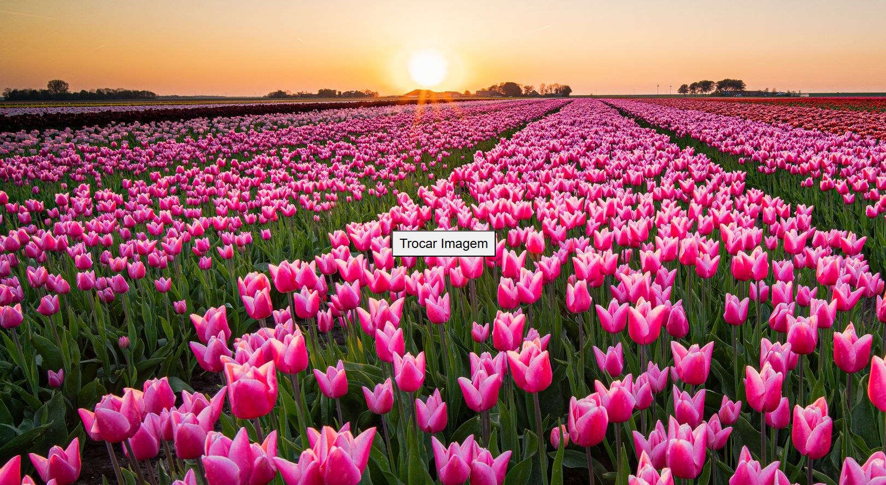

# Fundo-Tela

---

---

## Sobre
Projeto para trocar a imagem da página utilizando o JS. O intuito deste projeto é colocar em prática o conhecimento adquirido sobre as linguagens de marcação, HTML, CSS e Markdown, realizadas no curso técnico de desenvolvimento de sistemas do [Senai Jandira](./https://sp.senai.br/unidade/jandira/)

---

## Tecnologias utilizadas
- HTML 
- CSS 
- Markdown 
- Git
- JS

--- 

## Autor
[Isabelly Lima](https://www.linkedin.com/in/isabelly-silva-182a99349/)
